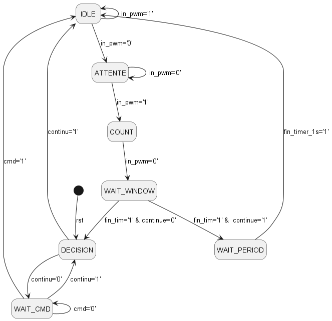
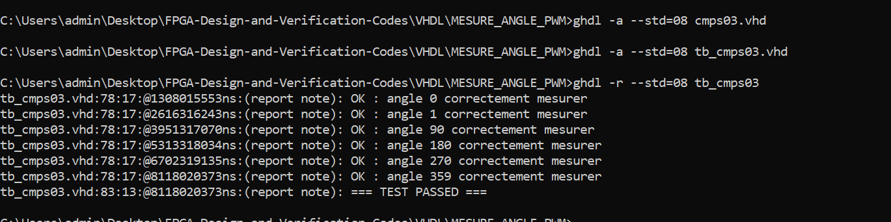
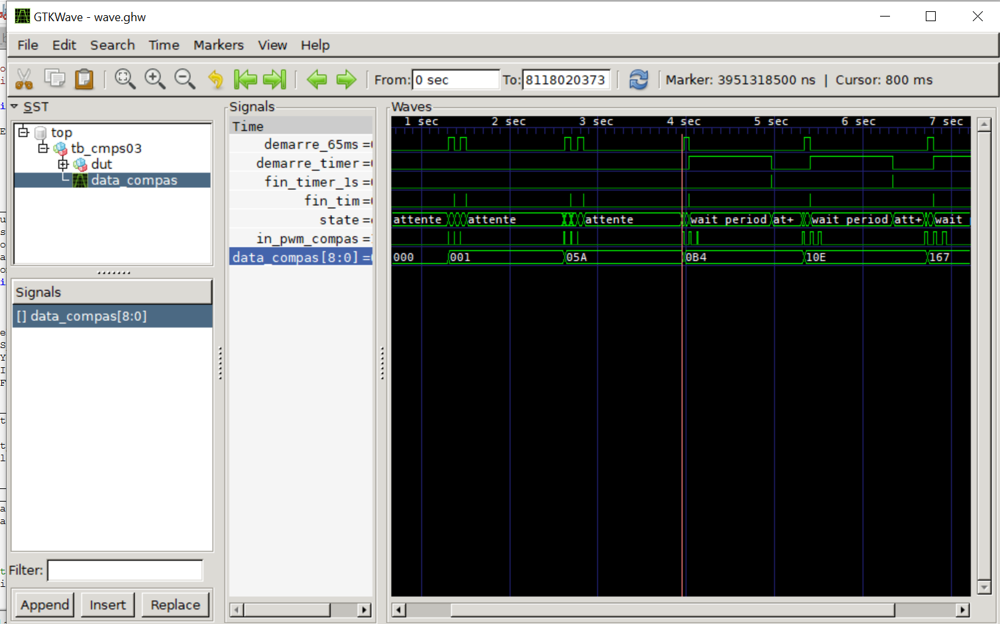
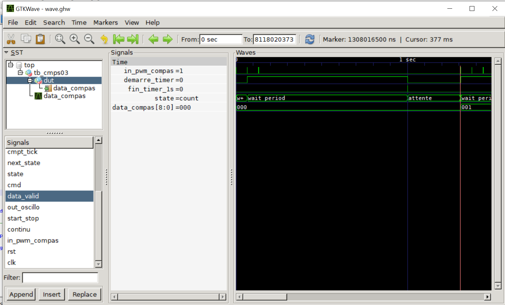
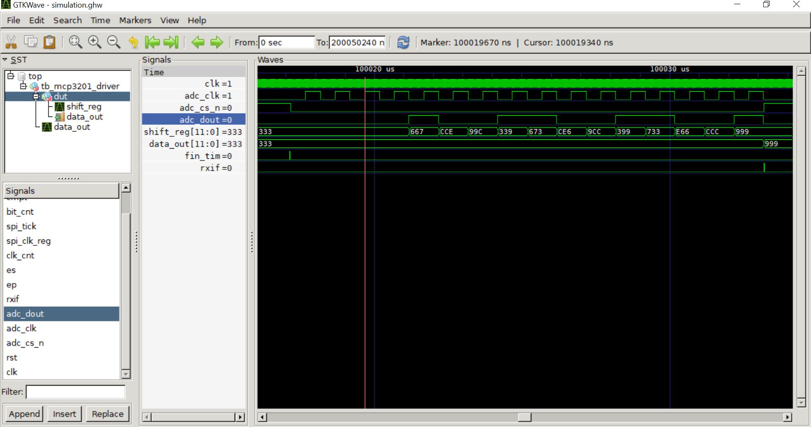
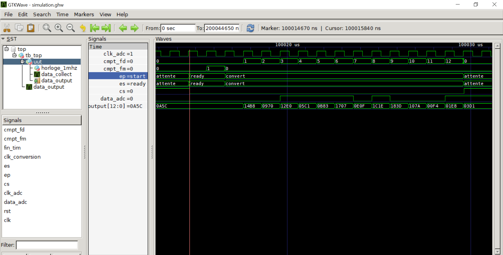
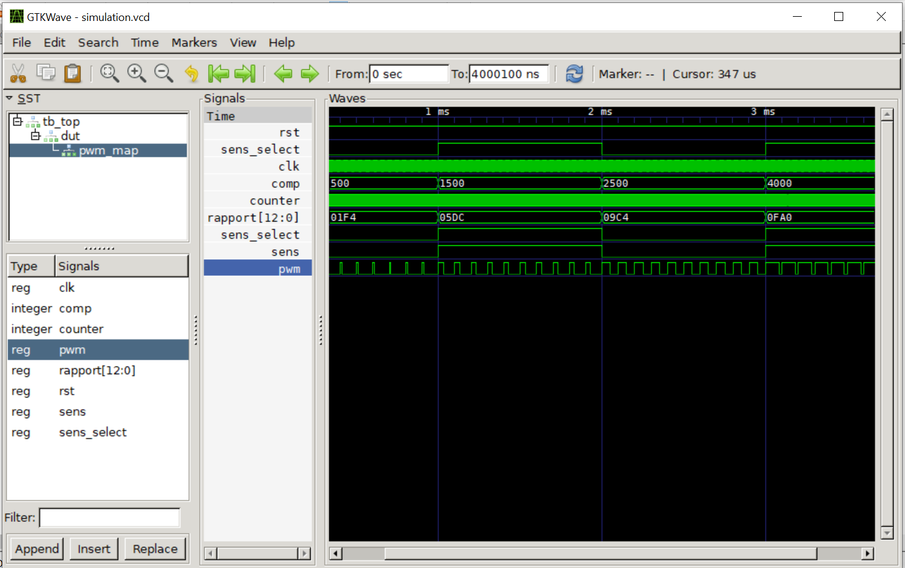
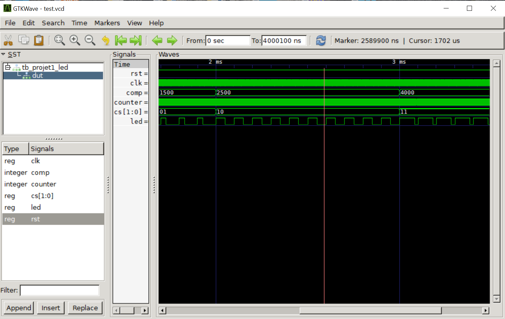
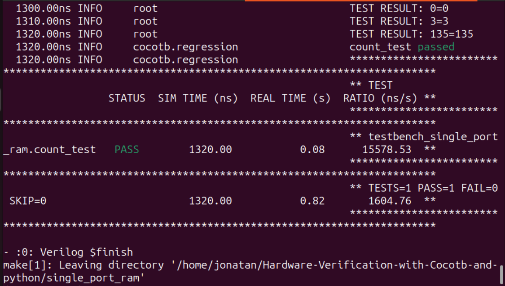

# MESURE CMPS03
### Machine à état 

## Resultats de la Simulation


### Observation du delai de 1s
Pour un rafraichissement d'une seconde en continu. On a 65ms après la mesure et esnuite 935ms d'attente.

# SIMULATION PROCEDURE OF GHDL AND GTKWAVE
The steps were implemented ton the projet ( vhdl/pwm_hierachique)
- compile the pwm entity
> ghdl -a --std=08 projet1_led.vhd
- compile the top level entity 
> ghdl -a --std=08 top.vhd
- compile the test bench
> ghdl -a --std=08 tp_top.vhd
- run the simulation and produce the simulation.vcd file to be read by gtkwave
> ghdl -r --std=08 tb_top --vcd=simulation.vcd
- launch gtkwave
> gtkwave simulation.vcd
 
 ### Visulaise state machines in simulation 
 - compile to have a .ghw file
 > ghdl -r --std=08 tb_top --wave=wave.ghw
 - visualise
 > gtkwave wave.ghw 
 # GTKWAVE SIMULATION FOR ADC 
 
 
# GTKWAVE RESULTS OF SIMULATIONS 
results of the test bench simulation of hierachical programming in vhdl.
I used top for upper level architecture and pwm as a low-level architecture


# GTKWAVE RESULTS WITH PWM


# HARDWARE VERIFICATION WITH COCOTB 
*Overview*


`Here is a series of folders concerning hardware verification with cocotb and python under icarus verilog software.`


> Writing testbench in system verilog or VHDL is sometimes complicated 
as the complexity of the design increases.So, writing testbench in 
python is much more simplier as python is a much simple programming language.

# What is COCOTB ?

Cocotb is a CO-routine based CO-simulation Testbench environment for verifying VHDL/Verilog RTL using python. It is an open-source environment.Cocotb can use Rivera-PRO  simulator to simulate the RTL.\

## Why COCOTB ?
Cocotb doesnot require any additional RTL code. The design under test (DUT) is instantiated as the top level in the simulator.Stimulus is applied onto the inputs to the DUT and outputs are monitored using Python.

With cocotb you write testbenches and verification code in `python`.
In addition to all the goodies of the Python programming language and its ecosystem, cocotb provides [a lean framework to efficiently write verification code](https://docs.cocotb.org)

### Requirements for Writing Testbench using COCOTB
- Linux environment 
- Python 3.6+
- GCC and associated development packages
- GNU Make 3+
- gnu compiler 
- VHDL/Verilog simulator e.g icarus verilator 
- Pytest

#### Installing Cocotb 
```
pip install cocotb
```
#### Installing Pytest 
```
pip install pytest 
```
### Installing icarus verilator

On ubuntu :
```
sudo apt-get install verilator
```
### Checking GCC version
```
gcc --version
```
## Running a Testbench 

```
cd single_port_ram
make clear 
make 
```
### Result of the Ram testbench 

